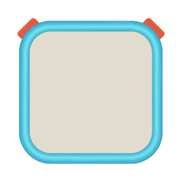

# yoto-nodejs-client
[](https://www.npmjs.com/package/yoto-nodejs-client)
[](https://github.com/bcomnes/yoto-nodejs-client/actions)

[](https://npmtrends.com/yoto-nodejs-client)

[](https://github.com/neostandard/neostandard)
[](https://socket.dev/npm/package/yoto-nodejs-client)

A comprehensive Node.js client for the [Yoto API][yoto-api] with automatic token refresh, MQTT device communication, stateful device management, and full TypeScript support.

**Features:**
- **YotoClient** - Low-level HTTP API client with automatic token refresh
- **YotoDeviceModel** - Stateful device client combining HTTP + MQTT for unified, real time device state
- **YotoAccount** - Multi-device account manager with automatic discovery and lifecycle management
- Full TypeScript types
- Real-time MQTT device control and monitoring
- Debugging CLI tools for authentication and data inspection

<p align="center">
  
</p>

```console
npm install yoto-nodejs-client
```

## Usage

### Basic API Client

```js
import { YotoClient } from 'yoto-nodejs-client'

// Authenticate using device flow (CLI/server applications)
const deviceCodeResponse = await YotoClient.requestDeviceCode({
  clientId: 'your-client-id'
})

console.log(`Visit ${deviceCodeResponse.verification_uri_complete}`)
console.log(`Enter code: ${deviceCodeResponse.user_code}`)

// Wait for authorization (simplest approach - handles polling automatically)
const tokenResponse = await YotoClient.waitForDeviceAuthorization({
  deviceCode: deviceCodeResponse.device_code,
  clientId: 'your-client-id',
  initialInterval: deviceCodeResponse.interval * 1000,
  expiresIn: deviceCodeResponse.expires_in,
  onPoll: (result) => {
    if (result.status === 'pending') process.stdout.write('.')
    if (result.status === 'slow_down') console.log('\nSlowing down...')
  }
})

// Create client with automatic token refresh
const client = new YotoClient({
  clientId: 'your-client-id',
  refreshToken: tokenResponse.refresh_token,
  accessToken: tokenResponse.access_token,
  onTokenRefresh: async (event) => {
    // REQUIRED: Persist tokens when they refresh
    await saveTokens({
      accessToken: event.updatedAccessToken,
      refreshToken: event.updatedRefreshToken,
      expiresAt: event.updatedExpiresAt
    })
  }
})

// Get devices
const { devices } = await client.getDevices()
console.log('Your devices:', devices)

// Get device status
const status = await client.getDeviceStatus({ 
  deviceId: devices[0].deviceId 
})
console.log('Battery:', status.batteryLevelPercentage, '%')

// Get user's MYO content
const myoContent = await client.getUserMyoContent()
console.log('Your content:', myoContent)

// Connect to device via MQTT for real-time control
const mqtt = await client.createMqttClient({
  deviceId: devices[0].deviceId
})

mqtt.on('events', (message) => {
  console.log('Playing:', message.trackTitle)
})

mqtt.on('status', (message) => {
  console.log('Volume:', message.volume, '%')
})

await mqtt.connect()
await mqtt.setVolume(50)
await mqtt.setAmbientHex('#FF0000')
```

### YotoDeviceModel - Stateful Device Client

```js
import { YotoClient, YotoDeviceModel } from 'yoto-nodejs-client'

// Create API client
const client = new YotoClient({
  clientId: 'your-client-id',
  refreshToken: 'your-refresh-token',
  accessToken: 'your-access-token',
  onTokenRefresh: async (event) => {
    await saveTokens(event)
  }
})

// Get a device
const { devices } = await client.getDevices()
const device = devices[0]

// Create stateful device client (manages HTTP + MQTT state)
const deviceClient = new YotoDeviceModel(client, device, {
  httpPollIntervalMs: 600000  // Background polling every 10 minutes
})

// Listen for status updates (from MQTT or HTTP)
deviceClient.on('statusUpdate', (status, source, changedFields) => {
  console.log(`Battery: ${status.batteryLevelPercentage}% (via ${source})`)
  console.log(`Temperature: ${status.temperatureCelsius}°C`)
  console.log(`Online: ${status.isOnline}`)
  console.log('Changed fields:', changedFields)
})

// Listen for config changes
deviceClient.on('configUpdate', (config, changedFields) => {
  console.log('Config updated:', config.maxVolumeLimit)
  console.log('Changed fields:', changedFields)
})

// Listen for playback events
deviceClient.on('playbackUpdate', (playback, changedFields) => {
  console.log(`Playing: ${playback.trackTitle}`)
  console.log(`Position: ${playback.position}/${playback.trackLength}s`)
  console.log('Changed fields:', changedFields)
})

// Listen for online/offline events
deviceClient.on('online', (metadata) => {
  if (metadata.reason === 'startup') {
    console.log(`Device powered on (uptime: ${metadata.upTime}s)`)
  } else {
    console.log('Device came online')
  }
})

deviceClient.on('offline', (metadata) => {
  if (metadata.reason === 'shutdown') {
    console.log(`Device shut down: ${metadata.shutDownReason}`)
  }
})

// Start the device client (connects MQTT, starts background polling)
await deviceClient.start()

// Access current state
console.log('Current status:', deviceClient.status)
console.log('Current config:', deviceClient.config)
console.log('Current playback:', deviceClient.playback)
console.log('Device capabilities:', deviceClient.capabilities)

// Control the device
await deviceClient.updateConfig({ maxVolumeLimit: '14' })
await deviceClient.sendCommand({ volume: 50 })

// Stop when done
await deviceClient.stop()
```

### Account Manager (Multiple Devices)

```js
import { YotoAccount } from 'yoto-nodejs-client'

// Create account manager
const account = new YotoAccount({
  clientOptions: {
    clientId: 'your-client-id',
    refreshToken: 'your-refresh-token',
    accessToken: 'your-access-token',
    onTokenRefresh: async (event) => {
      await saveTokens(event)
    }
  },
  deviceOptions: {
    httpPollIntervalMs: 600000  // Applied to all devices
  }
})

// Listen for account events
account.on('started', (metadata) => {
  console.log(`Managing ${metadata.deviceCount} devices`)
})


// Listen for device-specific events from individual devices
account.on('deviceAdded', (deviceId, deviceModel) => {
  // Attach event listeners to each device as it's added
  deviceModel.on('statusUpdate', (status, source) => {
    console.log(`${deviceId} battery: ${status.batteryLevelPercentage}%`)
  })

  deviceModel.on('online', (metadata) => {
    console.log(`${deviceId} came online`)
  })

  deviceModel.on('offline', (metadata) => {
    console.log(`${deviceId} went offline`)
  })
})

// Unified error handling
account.on('error', (error, context) => {
  console.error(`Error in ${context.source}:`, error.message)
  if (context.deviceId) {
    console.error(`Device: ${context.deviceId}`)
  }
})

// Start managing all devices
await account.start()

// Access individual devices
const device = account.getDevice('abc123')
console.log('Device status:', device.status)
console.log('Device config:', device.config)

// Get all devices
const allDevices = account.devices  // Map<deviceId, YotoDeviceModel>
console.log('Total devices:', allDevices.size)

// Refresh device list (add new, remove missing)
await account.refreshDevices()

// Stop all devices
await account.stop()
```

## API

### Authentication

#### `YotoClient.requestDeviceCode({ clientId, [scope], [audience] })`

Start the OAuth2 Device Authorization flow for CLI/server applications. Returns a device code and user verification URL.

- **clientId** - Your OAuth client ID
- **scope** - OAuth scopes (default: `'openid profile offline_access'`)
- **audience** - Token audience (default: `'https://api.yotoplay.com'`)

See [Yoto API: Device Code][api-device-code]

```js
const response = await YotoClient.requestDeviceCode({
  clientId: 'your-client-id'
})

console.log(`Visit: ${response.verification_uri_complete}`)
console.log(`Or go to ${response.verification_uri} and enter: ${response.user_code}`)
```

#### `YotoClient.exchangeToken({ grantType, ...params })`

Exchange authorization code, refresh token, or device code for access tokens.

- **grantType** - `'authorization_code'`, `'refresh_token'`, or `'urn:ietf:params:oauth:grant-type:device_code'`
- **code** - Authorization code (for `authorization_code` grant)
- **refreshToken** - Refresh token (for `refresh_token` grant)
- **deviceCode** - Device code (for device code grant)
- **clientId** - OAuth client ID
- **redirectUri** - Redirect URI (for `authorization_code` grant)
- **codeVerifier** - PKCE code verifier (optional)

See [Yoto API: Token Exchange][api-token]

```js
import { YotoClient, DEVICE_CODE_GRANT_TYPE } from 'yoto-nodejs-client'

// Exchange device code
const tokens = await YotoClient.exchangeToken({
  grantType: DEVICE_CODE_GRANT_TYPE,
  deviceCode: response.device_code,
  clientId: 'your-client-id'
})

// Refresh token
const refreshed = await YotoClient.exchangeToken({
  grantType: 'refresh_token',
  refreshToken: tokens.refresh_token,
  clientId: 'your-client-id'
})
```

#### `YotoClient.waitForDeviceAuthorization({ deviceCode, clientId, [initialInterval], [expiresIn], [onPoll] })`

Wait for device authorization to complete with automatic polling. This is the **simplest approach** - just call it and await the result. It handles all polling logic internally including interval adjustments and timeout detection.

Designed for CLI usage where you want to block until authorization completes. For UI implementations with custom progress feedback, use `pollForDeviceToken()` directly.

- **deviceCode** - Device code from `requestDeviceCode()`
- **clientId** - OAuth client ID
- **initialInterval** - Initial polling interval in milliseconds (default: 5000)
- **expiresIn** - Seconds until device code expires (for timeout detection)
- **audience** - Audience for the token (default: 'https://api.yotoplay.com')
- **onPoll** - Optional callback invoked after each poll attempt with the poll result

Returns a promise that resolves to `YotoTokenResponse` on successful authorization.

Throws `YotoAPIError` for unrecoverable errors (expired_token, access_denied, invalid_grant) or `Error` if device code expires.

See [Yoto API: Token Exchange][api-token]

```js
import { YotoClient } from 'yoto-nodejs-client'

// Simplest approach - just wait for tokens
const deviceAuth = await YotoClient.requestDeviceCode({
  clientId: 'your-client-id'
})

console.log(`Visit: ${deviceAuth.verification_uri_complete}`)
console.log(`Code: ${deviceAuth.user_code}`)

// This blocks until authorization completes (or fails)
const tokens = await YotoClient.waitForDeviceAuthorization({
  deviceCode: deviceAuth.device_code,
  clientId: 'your-client-id',
  initialInterval: deviceAuth.interval * 1000,
  expiresIn: deviceAuth.expires_in,
  onPoll: (result) => {
    if (result.status === 'pending') process.stdout.write('.')
    if (result.status === 'slow_down') console.log('\nSlowing down...')
  }
})

console.log('Got tokens:', tokens)
```

#### `YotoClient.pollForDeviceToken({ deviceCode, clientId, [currentInterval], [audience] })`

Poll for device authorization completion with automatic error handling (single poll attempt). This is a lower-level method that gives you control over the polling loop. Use `waitForDeviceAuthorization()` for a simpler approach.

Non-blocking - returns immediately with poll result. Suitable for:
- Manual polling loops in CLI applications
- Server-side endpoints that poll on behalf of clients (e.g., Homebridge UI server)
- Custom UI implementations with specific polling behavior

- **deviceCode** - Device code from `requestDeviceCode()`
- **clientId** - OAuth client ID
- **currentInterval** - Current polling interval in milliseconds (default: 5000)
- **audience** - Audience for the token (default: 'https://api.yotoplay.com')

Returns a promise that resolves to one of:
- `{ status: 'success', tokens: YotoTokenResponse }` - Authorization successful
- `{ status: 'pending', interval: number }` - Still waiting for user authorization
- `{ status: 'slow_down', interval: number }` - Polling too fast, use new interval

Throws `YotoAPIError` for unrecoverable errors (expired_token, access_denied, invalid_grant, etc).

See [Yoto API: Token Exchange][api-token]

```js
import { YotoClient } from 'yoto-nodejs-client'

// Manual polling loop with full control
const deviceAuth = await YotoClient.requestDeviceCode({
  clientId: 'your-client-id'
})

let interval = deviceAuth.interval * 1000

while (true) {
  const result = await YotoClient.pollForDeviceToken({
    deviceCode: deviceAuth.device_code,
    clientId: 'your-client-id',
    currentInterval: interval
  })

  if (result.status === 'success') {
    console.log('Tokens:', result.tokens)
    break
  } else if (result.status === 'slow_down') {
    interval = result.interval
  }
  
  // Sleep
  await new Promise(resolve => setTimeout(resolve, interval))
}
```

#### `YotoClient.getAuthorizeUrl({ clientId, redirectUri, responseType, state, ...params })`

Get authorization URL for browser-based OAuth flow. Returns a URL string to redirect users to.

See [Yoto API: Authorization][api-authorize]

### Client Instance

#### `new YotoClient({ clientId, refreshToken, accessToken, onTokenRefresh, [options] })`

Create a new Yoto API client with automatic token refresh.

- **clientId** - OAuth client ID
- **refreshToken** - OAuth refresh token
- **accessToken** - Initial access token (JWT)
- **onTokenRefresh** - **REQUIRED** callback for token refresh events. You MUST persist tokens here.
- **bufferSeconds** - Seconds before expiration to refresh (default: 30)
- **userAgent** - Optional user agent string to identify your application
- **defaultRequestOptions** - Optional default undici request options (dispatcher, timeouts, etc.) applied to all requests
- **onRefreshStart** - Optional callback when refresh starts. Console.logs by default.
- **onRefreshError** - Optional callback for transient refresh errors. Console.error's by default.
- **onInvalid** - Optional callback when refresh token is permanently invalid. Console.errors by default.

```js
const client = new YotoClient({
  clientId: 'your-client-id',
  refreshToken: 'stored-refresh-token',
  accessToken: 'stored-access-token',
  userAgent: 'MyApp/1.0.0',  // Optional - identifies your application
  defaultRequestOptions: {    // Optional - undici request options for all requests
    bodyTimeout: 30000,       // 30 second timeout
    headersTimeout: 10000,    // 10 second header timeout
    // dispatcher, signal, etc.
  },
  onTokenRefresh: async ({ updatedAccessToken, updatedRefreshToken, updatedExpiresAt }) => {
    // Save to database, file, etc.
    await db.saveTokens({ accessToken: updatedAccessToken, refreshToken: updatedRefreshToken, expiresAt: updatedExpiresAt })
  }
})
```

#### Request Options

All API methods accept an optional [undici][undici] `requestOptions` parameter that allows you to override the default undici request options for individual requests. This is useful for setting custom timeouts, using a specific dispatcher, or aborting requests.

```js
// Override timeout for a specific request
const content = await client.getContent({ 
  cardId: '5WsQg',
  requestOptions: {
    bodyTimeout: 60000,  // 60 second timeout for this request only
    headersTimeout: 20000
  }
})

// Use AbortSignal to cancel requests
const controller = new AbortController()
setTimeout(() => controller.abort(), 5000)

try {
  const devices = await client.getDevices({
    requestOptions: { signal: controller.signal }
  })
} catch (err) {
  if (err.name === 'AbortError') {
    console.log('Request was aborted')
  }
}

// Use custom dispatcher for connection pooling
import { Agent } from 'undici'
const agent = new Agent({ connections: 10 })

const status = await client.getDeviceStatus({
  deviceId: 'abc123',
  requestOptions: { dispatcher: agent }
})
```

**Available Request Options:**
- `bodyTimeout` - Body timeout in milliseconds
- `headersTimeout` - Headers timeout in milliseconds
- `signal` - AbortSignal to cancel the request
- `dispatcher` - Custom undici dispatcher (for connection pooling, proxies, etc.)
- `reset` - Reset connection after request
- `throwOnError` - Throw on HTTP error status codes
- `idempotent` - Whether the requests can be safely retried
- `blocking` - Whether the response is expected to take a long time
- Other undici RequestOptions (see [undici documentation](https://undici.nodejs.org/))

### Content API

#### `await client.getContent({ cardId, [timezone], [signingType], [playable] })`

Get content/card details including metadata, chapters, and optionally playback URLs.

See [Yoto API: Get Content][api-get-content]

```js
const content = await client.getContent({ 
  cardId: '5WsQg',
  playable: true  // Include signed playback URLs
})

console.log(content.title)
console.log(content.chapters)
```

#### `await client.getUserMyoContent({ [showDeleted] })`

Get user's MYO (Make Your Own) content library.

See [Yoto API: Get User's MYO Content][api-get-myo]

```js
const myoContent = await client.getUserMyoContent({ 
  showDeleted: false 
})

myoContent.cards.forEach(card => {
  console.log(`${card.metadata.title} - ${card.chapters.length} chapters`)
})
```

#### `await client.createOrUpdateContent({ content })`

Create new content or update existing content by cardId.

See [Yoto API: Create or Update Content][api-create-content]

```js
const newCard = await client.createOrUpdateContent({
  content: {
    title: 'My Story',
    chapters: [
      {
        title: 'Chapter 1',
        tracks: [
          {
            title: 'Part 1',
            key: 'upload-id-from-audio-upload'
          }
        ]
      }
    ]
  }
})

console.log('Created card:', newCard.cardId)
```

#### `await client.deleteContent({ cardId })`

Delete content/card.

See [Yoto API: Delete Content][api-delete-content]

```js
await client.deleteContent({ cardId: '5WsQg' })
```

### Devices API

#### `await client.getDevices()`

Get all devices for authenticated user.

See [Yoto API: Get Devices][api-get-devices]

```js
const { devices } = await client.getDevices()

devices.forEach(device => {
  console.log(`${device.name} (${device.deviceId}) - ${device.online ? 'online' : 'offline'}`)
})
```

#### `await client.getDeviceStatus({ deviceId })`

Get current status of a specific device including battery, volume, active card, etc.

See [Yoto API: Get Device Status][api-device-status]

```js
const status = await client.getDeviceStatus({ 
  deviceId: 'abc123' 
})

console.log('Battery:', status.batteryLevelPercentage, '%')
console.log('Charging:', status.isCharging)
console.log('Volume:', status.userVolumePercentage, '%')
console.log('Active card:', status.activeCard)
```

#### `await client.getDeviceConfig({ deviceId })`

Get device configuration including settings, timezone, shortcuts, etc.

See [Yoto API: Get Device Config][api-device-config]

```js
const config = await client.getDeviceConfig({ 
  deviceId: 'abc123' 
})

console.log('Name:', config.device.name)
console.log('Day time:', config.device.config.dayTime)
console.log('Night time:', config.device.config.nightTime)
console.log('Max volume:', config.device.config.maxVolumeLimit)
```

#### `await client.updateDeviceConfig({ deviceId, configUpdate })`

Update device configuration settings.

See [Yoto API: Update Device Config][api-update-config]

```js
await client.updateDeviceConfig({
  deviceId: 'abc123',
  configUpdate: {
    name: 'Bedroom Player',
    config: {
      dayTime: '07:00',
      nightTime: '19:00',
      maxVolumeLimit: '80'
    }
  }
})
```

#### `await client.updateDeviceShortcuts({ deviceId, shortcutsUpdate })`

Update device shortcuts configuration (beta feature).

See [Yoto API: Update Shortcuts][api-update-shortcuts]

#### `await client.sendDeviceCommand({ deviceId, command })`

Send MQTT command to device via HTTP API (alternative to MQTT client).

See [Yoto API: Send Device Command][api-send-command]

```js
await client.sendDeviceCommand({
  deviceId: 'abc123',
  command: {
    volume: 50
  }
})
```

### Family Library Groups API

#### `await client.getGroups()`

Get all family library groups.

See [Yoto API: Get Groups][api-get-groups]

```js
const groups = await client.getGroups()

groups.forEach(group => {
  console.log(`${group.name}: ${group.items.length} items`)
})
```

#### `await client.createGroup({ group })`

Create a new family library group.

See [Yoto API: Create Group][api-create-group]

```js
const group = await client.createGroup({
  group: {
    name: 'Bedtime Stories',
    imageId: 'fp-cards',
    items: [
      { contentId: '5WsQg' },
      { contentId: '7KpLq' }
    ]
  }
})
```

#### `await client.getGroup({ groupId })`

Get a specific group by ID.

See [Yoto API: Get a Group][api-get-group]

#### `await client.updateGroup({ groupId, group })`

Update an existing group.

See [Yoto API: Update Group][api-update-group]

#### `await client.deleteGroup({ groupId })`

Delete a group permanently.

See [Yoto API: Delete Group][api-delete-group]

### Family API

#### `await client.getFamilyImages()`

Get list of uploaded family images.

See [Yoto API: Get Family Images][api-family-images]

```js
const { images } = await client.getFamilyImages()

images.forEach(image => {
  console.log(`${image.name || 'Unnamed'}: ${image.imageId}`)
})
```

#### `await client.getAFamilyImage({ imageId, size })`

Get signed URL for a family image.

See [Yoto API: Get a Family Image][api-get-family-image]

```js
const { imageUrl } = await client.getAFamilyImage({
  imageId: 'abc123hash',
  size: '640x480'  // or '320x320'
})

console.log('Image URL:', imageUrl)
```

#### `await client.uploadAFamilyImage({ imageData })`

Upload a family image for use across Yoto features.

See [Yoto API: Upload Family Image][api-upload-family-image]

```js
import { readFile } from 'fs/promises'

const imageData = await readFile('./family-photo.jpg')
const result = await client.uploadAFamilyImage({ imageData })

console.log('Image ID:', result.imageId)
```

### Icons API

#### `await client.getPublicIcons()`

Get list of public display icons available to all users.

See [Yoto API: Get Public Icons][api-public-icons]

```js
const { displayIcons } = await client.getPublicIcons()

displayIcons.forEach(icon => {
  console.log(`${icon.title}: ${icon.displayIconId}`)
})
```

#### `await client.getUserIcons()`

Get user's custom uploaded icons.

See [Yoto API: Get User Icons][api-user-icons]

#### `await client.uploadIcon({ imageData, [autoConvert], [filename] })`

Upload a custom 16×16px display icon.

See [Yoto API: Upload Custom Icon][api-upload-icon]

```js
import { readFile } from 'fs/promises'

const imageData = await readFile('./my-icon.png')
const result = await client.uploadIcon({
  imageData,
  autoConvert: true,  // Auto-resize and process
  filename: 'my-custom-icon'
})

console.log('Icon ID:', result.displayIcon.displayIconId)
```

### Media API

#### `await client.getAudioUploadUrl({ sha256, [filename] })`

Get signed URL for uploading audio files. Files are deduplicated by SHA256 hash.

See [Yoto API: Get Audio Upload URL][api-audio-upload]

```js
import { createHash } from 'crypto'
import { readFile } from 'fs/promises'

const audioData = await readFile('./story.mp3')
const sha256 = createHash('sha256').update(audioData).digest('hex')

const { upload } = await client.getAudioUploadUrl({ 
  sha256,
  filename: 'story.mp3'
})

if (upload.uploadUrl) {
  // File doesn't exist, upload it
  await fetch(upload.uploadUrl, {
    method: 'PUT',
    body: audioData
  })
}

// Use upload.uploadId in content creation
```

#### `await client.uploadCoverImage({ [imageData], [imageUrl], [coverType], [autoConvert], [filename] })`

Upload a cover image for content cards.

See [Yoto API: Upload Cover Image][api-cover-image]

```js
import { readFile } from 'fs/promises'

const imageData = await readFile('./cover.jpg')
const { coverImage } = await client.uploadCoverImage({
  imageData,
  coverType: 'default',  // 638×1011px
  autoConvert: true
})

console.log('Cover image ID:', coverImage.mediaId)
```

### MQTT Client

#### `await client.createMqttClient({ deviceId, [options] })`

Create an MQTT client for real-time device communication and control.

See [Yoto MQTT Documentation][mqtt-docs]

```js
const mqtt = await client.createMqttClient({
  deviceId: 'abc123',
  autoResubscribe: true,
  keepAliveSeconds: 1200
})

// Listen for real-time events
mqtt.on('events', (message) => {
  console.log('Track:', message.trackTitle)
  console.log('Card:', message.cardTitle)
  console.log('Status:', message.playbackStatus)
})

// Listen for status updates
mqtt.on('status', (message) => {
  console.log('Volume:', message.volume)
  console.log('Battery:', message.batteryLevel)
  console.log('Charging:', message.charging)
})

// Listen for command responses
mqtt.on('response', (message) => {
  console.log('Command response:', message)
})

// Connect to device
await mqtt.connect()

// Control device
await mqtt.setVolume(50)
await mqtt.setAmbientHex('#FF0000')
await mqtt.setSleepTimer(30)  // 30 minutes
await mqtt.startCard({ cardId: '5WsQg' })
await mqtt.pauseCard()
await mqtt.resumeCard()
await mqtt.stopCard()

// Disconnect when done
await mqtt.disconnect()
```

#### MQTT Events

The MQTT client emits three types of messages:

- **`events`** - Real-time playback events (track changes, play/pause, volume adjustments)
- **`status`** - Device status updates (battery, configuration, online state)
- **`response`** - Command confirmation responses

#### MQTT Methods

- `await mqtt.connect()` - Connect to device MQTT broker
- `await mqtt.disconnect()` - Disconnect from broker
- `await mqtt.setVolume(volume)` - Set volume (0-100)
- `await mqtt.setAmbientHex(hex)` - Set ambient light color (e.g., '#FF0000')
- `await mqtt.setSleepTimer(minutes)` - Set sleep timer (0 to disable)
- `await mqtt.startCard({ cardId, chapterKey, trackKey })` - Start playing a card
- `await mqtt.pauseCard()` - Pause current playback
- `await mqtt.resumeCard()` - Resume playback
- `await mqtt.stopCard()` - Stop playback
- `await mqtt.reboot()` - Reboot device

### YotoDeviceModel - Stateful Device Client

#### `new YotoDeviceModel(client, device, [options])`

Create a stateful device client that manages device state primarily from MQTT with HTTP background sync.

**Philosophy:**
- MQTT is the primary source for all real-time status updates
- MQTT connection is always maintained and handles its own reconnection
- Device online/offline state is tracked by MQTT activity and explicit shutdown messages
- HTTP background polling runs every 10 minutes to sync config+status regardless of online state
- HTTP status updates emit offline events if device state changes to offline

**Parameters:**
- `client` - YotoClient instance
- `device` - Device object from `getDevices()`
- `options.httpPollIntervalMs` - Background HTTP polling interval (default: 600000ms / 10 minutes)
- `options.mqttOptions` - MQTT.js client options to pass through

**Lifecycle:**
- `await deviceClient.start()` - Start device client (connects MQTT, starts polling)
- `await deviceClient.stop()` - Stop device client (disconnects MQTT, stops polling)
- `await deviceClient.restart()` - Restart device client

**State Accessors:**
- `deviceClient.device` - Device information
- `deviceClient.status` - Current device status (normalized from HTTP/MQTT)
- `deviceClient.config` - Device configuration
- `deviceClient.shortcuts` - Button shortcuts
- `deviceClient.playback` - Current playback state
- `deviceClient.capabilities` - Hardware capabilities (sensors, nightlight support, etc.)
- `deviceClient.nightlight` - Nightlight info: { value, name, supported }
- `deviceClient.initialized` - Whether device has been initialized
- `deviceClient.running` - Whether device client is currently running
- `deviceClient.mqttConnected` - MQTT connection status
- `deviceClient.deviceOnline` - Device online status
- `deviceClient.mqttClient` - Underlying MQTT client instance (or null)

**Device Control:**
- `await deviceClient.refreshConfig()` - Refresh config from HTTP API
- `await deviceClient.updateConfig(configUpdate)` - Update device configuration
- `await deviceClient.sendCommand(command)` - Send device command via HTTP

**Events:**
- `started(metadata)` - Device client started, passes metadata object with device, config, shortcuts, status, playback, initialized, running
- `stopped()` - Device client stopped
- `statusUpdate(status, source, changedFields)` - Status changed, passes (status, source, changedFields). Source is 'http', 'mqtt', or 'mqtt-event'
- `configUpdate(config, changedFields)` - Configuration changed, passes (config, changedFields)
- `playbackUpdate(playback, changedFields)` - Playback state changed, passes (playback, changedFields)
- `online(metadata)` - Device came online, passes metadata with reason and optional upTime
- `offline(metadata)` - Device went offline, passes metadata with reason and optional shutDownReason or timeSinceLastSeen
- `mqttConnected()` - MQTT client connected
- `mqttDisconnected()` - MQTT client disconnected
- `error(error)` - Error occurred, passes error

**Static Properties & Methods:**
- `YotoDeviceModel.NIGHTLIGHT_COLORS` - Map of nightlight color hex codes to official color names
- `YotoDeviceModel.getNightlightColorName(colorValue)` - Get official color name for a nightlight value

```js
import { YotoClient, YotoDeviceModel } from 'yoto-nodejs-client'

const client = new YotoClient({ /* ... */ })
const { devices } = await client.getDevices()

const deviceClient = new YotoDeviceModel(client, devices[0], {
  httpPollIntervalMs: 300000  // Poll every 5 minutes
})

deviceClient.on('statusUpdate', (status, source, changedFields) => {
  console.log(`Battery: ${status.batteryLevelPercentage}% (${source})`)
  console.log('Changed fields:', changedFields)
})

deviceClient.on('online', (metadata) => {
  console.log('Device online:', metadata.reason)
})

await deviceClient.start()

// Access state
console.log('Temperature:', deviceClient.status.temperatureCelsius)
console.log('Has temp sensor:', deviceClient.capabilities.hasTemperatureSensor)
console.log('Nightlight:', deviceClient.nightlight)  // { value, name, supported }

// Use static nightlight utilities
console.log('Available colors:', YotoDeviceModel.NIGHTLIGHT_COLORS)
console.log('Color name:', YotoDeviceModel.getNightlightColorName('0x643600'))

// Control device
await deviceClient.updateConfig({ maxVolumeLimit: '14' })

await deviceClient.stop()
```

### Account Manager

#### `new YotoAccount({ clientOptions, deviceOptions })`

Create an account manager that automatically discovers and manages all devices for a Yoto account.

**Parameters:**
- `clientOptions` - YotoClient constructor options (clientId, refreshToken, accessToken, onTokenRefresh, etc.)
- `deviceOptions` - YotoDeviceModel options applied to all devices (httpPollIntervalMs, mqttOptions)

**Lifecycle:**
- `await account.start()` - Start account (creates client, discovers devices, starts all device clients)
- `await account.stop()` - Stop account (stops all device clients gracefully)
- `await account.restart()` - Restart account
- `await account.refreshDevices()` - Refresh device list (add new, remove missing)

**State Accessors:**
- `account.client` - Underlying YotoClient instance
- `account.devices` - Map of all device models (Map<deviceId, YotoDeviceModel>)
- `account.getDevice(deviceId)` - Get specific device model
- `account.getDeviceIds()` - Get array of all device IDs
- `account.running` - Whether account is currently running
- `account.initialized` - Whether account has been initialized

**Events:**
- `started(metadata)` - Account started (metadata: { deviceCount, devices })
- `stopped()` - Account stopped
- `deviceAdded(deviceId, deviceModel)` - Device was added
- `deviceRemoved(deviceId)` - Device was removed
- `error(error, context)` - Error occurred (context: { source, deviceId, operation })

**Note:** To listen to individual device events (statusUpdate, configUpdate, playbackUpdate, online, offline, mqttConnected, mqttDisconnected, etc.), access the device models directly via `account.devices` or `account.getDevice(deviceId)` and attach listeners to them.

```js
import { YotoAccount } from 'yoto-nodejs-client'

const account = new YotoAccount({
  clientOptions: {
    clientId: 'your-client-id',
    refreshToken: 'your-refresh-token',
    accessToken: 'your-access-token',
    onTokenRefresh: async (event) => {
      await saveTokens(event)
    }
  },
  deviceOptions: {
    httpPollIntervalMs: 600000  // 10 minutes
  }
})

// Account-level error handling
account.on('error', (error, context) => {
  console.error(`Error in ${context.source}:`, error.message)
})

// Listen to device added events
account.on('deviceAdded', (deviceId, deviceModel) => {
  console.log(`Device ${deviceId} added`)
  
  // Attach listeners to individual devices
  deviceModel.on('statusUpdate', (status, source) => {
    console.log(`${deviceId} battery: ${status.batteryLevelPercentage}%`)
  })
  
  deviceModel.on('online', (metadata) => {
    console.log(`${deviceId} came online (${metadata.reason})`)
  })
  
  deviceModel.on('offline', (metadata) => {
    console.log(`${deviceId} went offline (${metadata.reason})`)
  })
})

await account.start()

// Access individual devices and attach listeners
const device = account.getDevice('abc123')
console.log('Device battery:', device.status.batteryLevelPercentage)

// Listen to specific device events
device.on('playbackUpdate', (playback) => {
  console.log('Now playing:', playback.currentCardTitle)
})

// Iterate all devices and attach listeners
for (const [deviceId, deviceModel] of account.devices) {
  console.log(`${deviceId}: ${deviceModel.status.batteryLevelPercentage}%`)
  
  deviceModel.on('configUpdate', (config) => {
    console.log(`${deviceId} config updated:`, config.name)
  })
}

await account.stop()
```

## CLI Tools

The library includes CLI tools for authentication and data inspection. After installing the package, these commands are available globally:

### Authentication

```bash
# Get initial tokens (device flow)
yoto-auth --output .env
# or: node bin/auth.js --output .env

# Refresh existing tokens
yoto-refresh-token
# or: node bin/refresh-token.js

# Show token info and inspect JWT contents
yoto-token-info
# or: node bin/token-info.js
```

### Devices

```bash
# List all devices
yoto-devices
# or: node bin/devices.js

# Get device details with config
yoto-devices --device-id abc123

# Get device status only
yoto-devices --device-id abc123 --status

# Connect to MQTT and listen for messages
yoto-devices --device-id abc123 --mqtt

# Sample MQTT messages for 10 seconds
yoto-devices --device-id abc123 --mqtt --mqtt-timeout 10

# Use YotoDeviceModel to monitor device (HTTP + MQTT)
yoto-device-model --device-id abc123

# Interactive TUI for device control (Prototype/WIP/Unpublished)
yoto-device-tui --device-id abc123
```

### Content

```bash
# List all MYO content
yoto-content
# or: node bin/content.js

# Get specific card details
yoto-content --card-id 5WsQg

# Get card with playable URLs
yoto-content --card-id 5WsQg --playable
```

### Family Library Groups

```bash
# List all family library groups
yoto-groups
# or: node bin/groups.js

# Get specific group details
yoto-groups --group-id abc123
```

### Icons

```bash
# List both public and user icons
yoto-icons
# or: node bin/icons.js

# List only public Yoto icons
yoto-icons --public

# List only user custom icons
yoto-icons --user
```

## See also

- [Yoto API Documentation][yoto-api]
- [Yoto MQTT Documentation][mqtt-docs]
- [Yoto Developer Portal][yoto-dev]

## License

MIT

[yoto-api]: https://yoto.dev/api/
[yoto-dev]: https://yoto.dev/
[mqtt-docs]: https://yoto.dev/players-mqtt/mqtt-docs/
[api-device-code]: https://yoto.dev/api/post-oauth-device-code/
[api-token]: https://yoto.dev/api/post-oauth-token/
[api-authorize]: https://yoto.dev/api/get-authorize/
[api-get-content]: https://yoto.dev/api/getcontent/
[api-get-myo]: https://yoto.dev/api/getusersmyocontent/
[api-create-content]: https://yoto.dev/api/createorupdatecontent/
[api-delete-content]: https://yoto.dev/api/deletecontent/
[api-get-devices]: https://yoto.dev/api/getdevices/
[api-device-status]: https://yoto.dev/api/getdevicestatus/
[api-device-config]: https://yoto.dev/api/getdeviceconfig/
[api-update-config]: https://yoto.dev/api/updatedeviceconfig/
[api-update-shortcuts]: https://yoto.dev/api/updateshortcutsbeta/
[api-send-command]: https://yoto.dev/api/senddevicecommand/
[api-get-groups]: https://yoto.dev/api/getgroups/
[api-create-group]: https://yoto.dev/api/createagroup/
[api-get-group]: https://yoto.dev/api/getagroup/
[api-update-group]: https://yoto.dev/api/updateagroup/
[api-delete-group]: https://yoto.dev/api/deleteagroup/
[api-family-images]: https://yoto.dev/api/getfamilyimages/
[api-get-family-image]: https://yoto.dev/api/getafamilyimage/
[api-upload-family-image]: https://yoto.dev/api/uploadafamilyimage/
[api-public-icons]: https://yoto.dev/api/getpublicicons/
[api-user-icons]: https://yoto.dev/api/getusericons/
[api-upload-icon]: https://yoto.dev/api/uploadcustomicon/
[api-audio-upload]: https://yoto.dev/api/getanuploadurl/
[api-cover-image]: https://yoto.dev/api/uploadcoverimage/
[undici]: https://undici.nodejs.org/#/docs/api/Client.md
